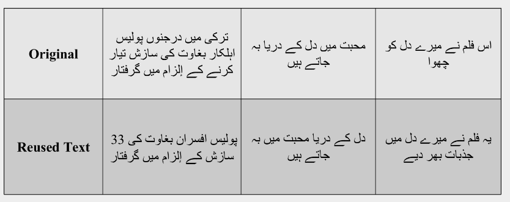
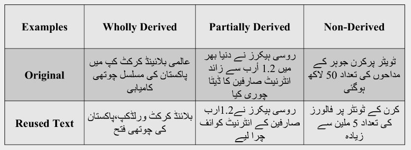
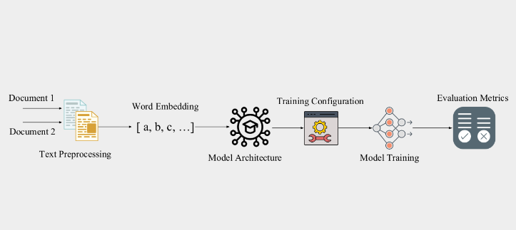

# Urdu Plagiarism Checker

The UrduPlagCheckAI Model makes a significant contribution to the Urdu Adab language. It is an advanced AI solution that effectively identifies and eliminates plagiarism in Urdu text.

## Examples




## Model Training Results

**Model Accuracy**


**Lose**


## Internal Architecture




### Usage

```bash
> Copy `LSTM.ipynb` to `google colabs`.
> Run All cells
> download model and use it anywhere.
```

[Want Help?](https://github.com/Zain-ul-din/Urdu_Pleg_Checker/issues)


